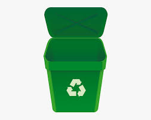

```markdown
# Smart Waste Bin Project

Welcome to the Smart-Bin project repository! 🌍🗑️



## Overview

This project aims to revolutionize waste management by combining smart technology with environmental sustainability. Using Wokwi's simulation capabilities, we have developed a prototype of a Smart Waste Bin that employs sensors and automation to streamline waste collection and optimize efficiency.

## Key Features

- 🌐 Connected System: The simulation demonstrates a connected wastebin prototype equipped with sensors for real-time waste level detection.

- 📈 Efficient Waste Management: When the wastebin's fill level reaches a certain threshold, notifications are triggered to facilitate timely waste collection and prevent overflow.

- ⚙️ Automatic Lid Mechanism: Through simulated hardware components, we have implemented an automatic lid mechanism for user convenience and hygiene.

- 📊 Data Insights: The project showcases how data collected from these smart waste bins can provide valuable insights into waste generation patterns, leading to improved waste management strategies.

## How to Use

1. Open the project simulation using Wokwi's platform: https://wokwi.com/projects/371497490504905729
https://wokwi.com/projects/370977226341392385

2. Explore the simulation to observe the smart waste bin in action and how it responds to various scenarios.

## Contributing

Contributions to enhance this project are welcome! Whether it's refining the simulation, improving the documentation, or suggesting new features, feel free to open an issue or submit a pull request.

## Credits

This project is brought to you by Christopher Aliu. Connect with me on LinkedIn: https://www.linkedin.com/in/al-chris

## License

This project is licensed under the [MIT License](LICENSE).

Let's embrace innovation and sustainability for a greener future! 🌱💡

Simulation Link: https://wokwi.com/projects/370977226341392385

LinkedIn Profile Link: https://www.linkedin.com/in/al-chris

